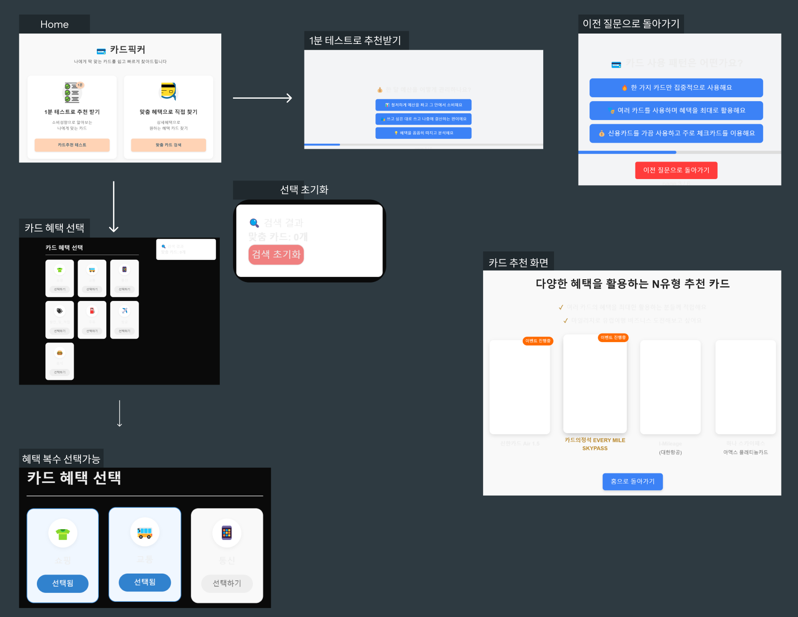

프로젝트 : 카드 추천 서비스
=========
##### 카드를 추천하는 알고리즘 구현 , 
##### 상세 카드정보는 실제 카드 사이트 URL 과 연결
***
## TEAM INFO
  ### 🧑‍💻[민성](https://github.com/k800712)
  ### 🧑‍💻[해준](https://github.com/gowns12)
  ### 🧑‍💻[지예](https://github.com/jun045)
  ### 🧑‍💻[채연](https://github.com/lch0208)
  ### 🧑‍💻[인혁](https://github.com/booungyi)    
***

  > #### 활용 언어 ####

  > #### 활용 프레임워크 ####
   
React , Next
***
### 화면 레이아웃 설계 ###

#### 1. 홈화면  
- 사이트에 접속하면 처음 나오는 페이지
- 맞춤 혜택으로 직접 찾거나 테스트를 봐서 카드를 추천 받을수 있다.
#### 2_1 카드 혜택 선택 화면
- 사이트에 접속하면 카테고리를 선택할수있다.
- 여러 카테고리를 선택할 수있고 다시 누르면 취소된다.
- 카테고리를 한번에 취소할수 있는 검색 초기화 버튼도 있다.
#### 2_2.1 테스트로 추천받기
- 테스트를 볼수 있고 테스트의 결과에 따라 카드를 추천 받는다
- 이전 테스트를 다시볼수도 있다. 이전 질문으로 돌아가는 버튼을 구현했다.
#### 2_2.2 카드 추천 화면
- 화면에 카드들이 좌우로 스와이프 되면서 카드를 누르면 카드 상세화면으로 넘어간다.
***
ENTITY 설계
===
***
### 카드
  - 카드 id | id
  - 카드 이름 | cardName
  - 카드 카테고리 | category
  - 카드 설명 | description
  - 카드 연회비 | annual_fee
  - 카드 이미지 | image_url
  - 카드 상세정보 페이지 | detail_url
  - 등록 날짜 | createAt
#### 카드 추천 Request
- 카드 발급사
- 카드 카테고리
#### 카테고리 Enum 
  - 통신
  - 쇼핑
  - 할인 및 적립
  - 적립
  - 교통
  - 주유
  - 음식
  - 항공
  - 기타 

